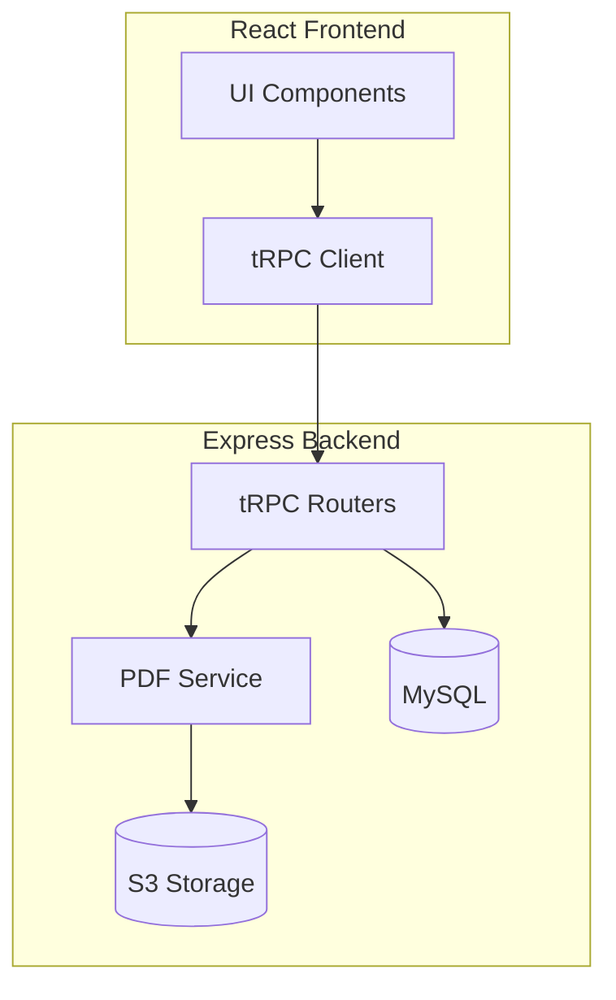

# Mantodeus Manager - MVP Implementation Plan

## Current State Summary

Your codebase already has solid foundations:

- [drizzle/schema.ts](drizzle/schema.ts) - Projects, Jobs, Users, Contacts, Files
- [server/pdfExport.ts](server/pdfExport.ts) - HTML template (needs Puppeteer conversion)
- Image pipeline with S3, annotation tools, PWA support

---

## Architecture Overview



---

## Sprint 1: Puppeteer PDF Microservice (Priority 1)

### 1.1 Set Up Puppeteer Service

Create `server/services/pdfService.ts`:

- Install puppeteer (not puppeteer-core for Infomaniak Cloud Server)
- Create singleton browser instance with connection pooling
- Implement `generatePDF(html: string): Promise<Buffer>` function
- Handle Chromium path for Infomaniak environment

### 1.2 Extend PDF Templates

Refactor [server/pdfExport.ts](server/pdfExport.ts):

- Create modular template system: `ProjectReportTemplate`, `InvoiceTemplate`, `InspectionTemplate`
- Add German-specific invoice fields (Steuernummer, IBAN/BIC, VAT toggle)
- Add Kleinunternehmer text option: "Keine Umsatzsteuer aufgrund der Kleinunternehmerregelung, Paragraph 19 UStG"
- Use CSS print styles for pixel-perfect A4 output

### 1.3 Add Shareable Links with Expiry

New database table:

```sql
CREATE TABLE shared_documents (
  id INT AUTO_INCREMENT PRIMARY KEY,
  documentType ENUM('project_report', 'invoice', 'inspection') NOT NULL,
  referenceId INT NOT NULL,
  s3Key VARCHAR(500) NOT NULL,
  shareToken VARCHAR(64) UNIQUE NOT NULL,
  expiresAt TIMESTAMP NOT NULL,
  createdBy INT NOT NULL REFERENCES users(id),
  createdAt TIMESTAMP DEFAULT CURRENT_TIMESTAMP
);
```


### 1.4 New tRPC Endpoints

Add to `server/routers.ts`:

- `pdf.generateProjectReport({ projectId })` - Generate and store PDF
- `pdf.generateInvoice({ invoiceId, settings })` - With VAT/Kleinunternehmer options
- `pdf.createShareLink({ documentId, expiryHours })` - Returns shareable URL
- Public route: `GET /share/:token` - Serves PDF if not expired

---

## Sprint 2: German Invoice Settings

### 3.1 Company Settings Table

```sql
CREATE TABLE company_settings (
  id INT AUTO_INCREMENT PRIMARY KEY,
  userId INT UNIQUE NOT NULL REFERENCES users(id),
  companyName VARCHAR(255),
  address TEXT,
  steuernummer VARCHAR(50),
  ustIdNr VARCHAR(50),
  iban VARCHAR(34),
  bic VARCHAR(11),
  isKleinunternehmer BOOLEAN DEFAULT false,
  vatRate DECIMAL(5,2) DEFAULT 19.00,
  invoicePrefix VARCHAR(10) DEFAULT 'RE',
  nextInvoiceNumber INT DEFAULT 1,
  createdAt TIMESTAMP DEFAULT CURRENT_TIMESTAMP,
  updatedAt TIMESTAMP DEFAULT CURRENT_TIMESTAMP ON UPDATE CURRENT_TIMESTAMP
);
```


### 3.2 Invoice Generation

- Settings page for company details
- Invoice template with proper German formatting
- Auto-increment Rechnungsnummer (RE-2025-0001)
- VAT calculation or Kleinunternehmer text based on setting
- Bank details in footer

---

## Sprint 3: Supporting MVP Features

### 4.1 User Check-in/Check-out

Add to projects schema:

```sql
CREATE TABLE project_checkins (
  id INT AUTO_INCREMENT PRIMARY KEY,
  projectId INT NOT NULL REFERENCES projects(id),
  userId INT NOT NULL REFERENCES users(id),
  checkInTime TIMESTAMP NOT NULL,
  checkOutTime TIMESTAMP,
  latitude DECIMAL(10,8),
  longitude DECIMAL(11,8),
  notes TEXT
);
```


- "Check In" button on project detail (captures time + optional GPS)
- "Check Out" button with optional notes
- Time tracking summary per user per project

### 4.2 Photo Tagging System

Add to file_metadata:

```sql
ALTER TABLE file_metadata ADD COLUMN tags JSON;
-- Tags: ["safety", "defect", "anchor", "quote", "before", "after"]
```


- Tag selector when uploading photos
- Filter gallery by tags
- Manual tag selection (AI auto-suggest deferred to later phase)

---

## Deployment Considerations

### Infomaniak Cloud Server Requirements

For Puppeteer (Chromium):

- Cloud Server (not shared hosting) - minimum 2GB RAM
- Install Chromium dependencies: `apt-get install chromium-browser`
- Set `PUPPETEER_EXECUTABLE_PATH=/usr/bin/chromium-browser`

### Environment Variables to Add

```env
# PDF Service
PUPPETEER_EXECUTABLE_PATH=/usr/bin/chromium-browser
PDF_EXPIRY_DEFAULT_HOURS=168

# Company defaults (can be overridden per-user)
DEFAULT_VAT_RATE=19
```

---

## File Structure (New)

```javascript
server/
  services/
    pdfService.ts       # Puppeteer wrapper
  templates/
    projectReport.ts    # HTML template
    invoice.ts          # German invoice template
    inspection.ts       # Inspection form template
  pdfRouter.ts          # PDF generation endpoints
  settingsRouter.ts     # Company settings CRUD

client/src/
  components/
    InvoiceSettings.tsx # Company settings form
    CheckInButton.tsx   # Geolocation check-in
    PhotoTagger.tsx     # Tag selector for uploads
  pages/
    Settings.tsx        # Company/invoice settings page

```